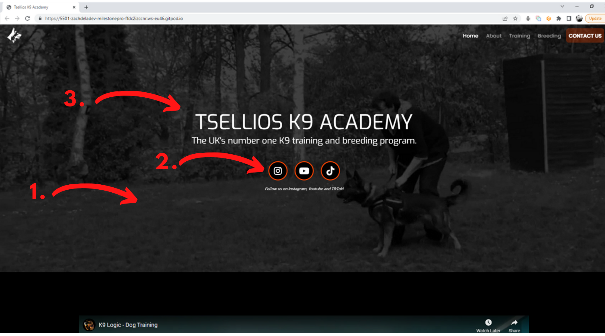
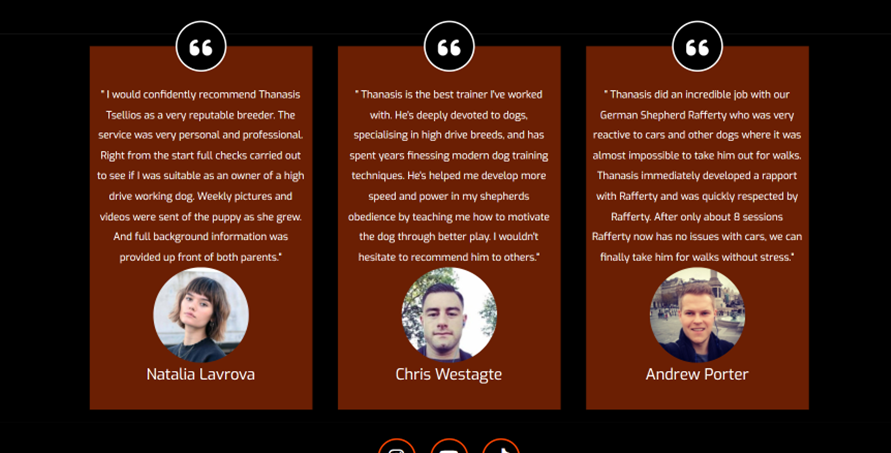
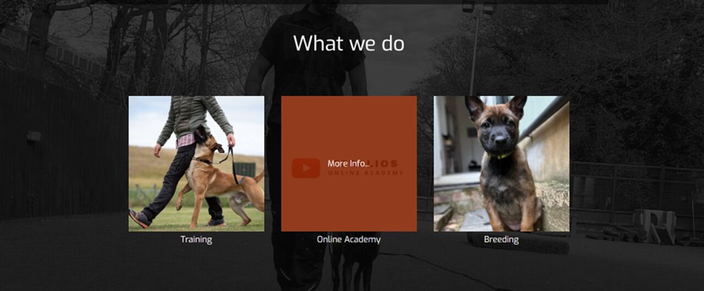
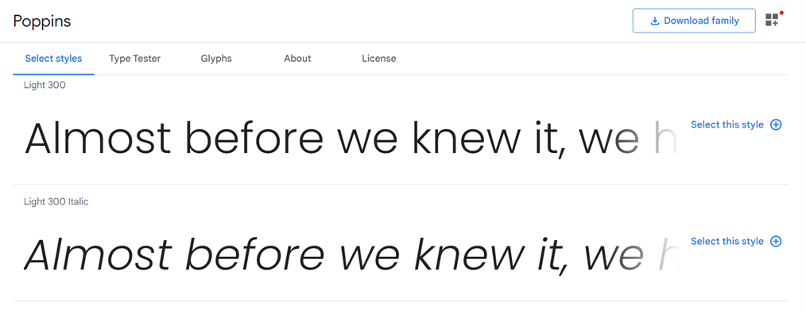
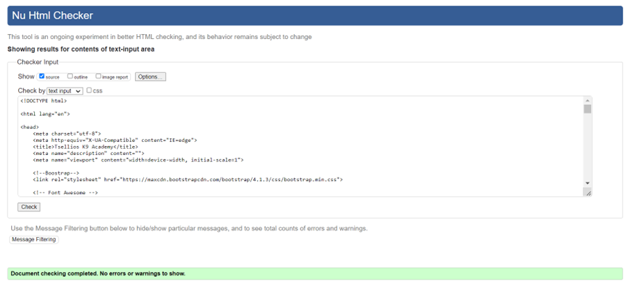
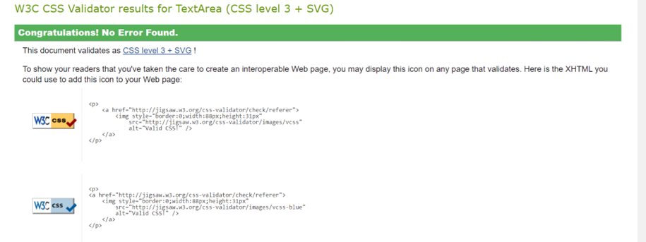

<h1 align="center">Tsellios K9 Academy</h1>


<h2 align="center"></h2>

<h1 align="center"></h1>

## **Project Overview**
[View the live project here.](https://zach-deladev.github.io/milestone-project-frontend/)

This is the main marketing website for Tsellios K9 Academy. It is designed to be responsive and accessible on both mobile and desktop devices, making it easy to both use and navigate for potential customers.

This project is the first milestone project completed by myself while working towards my qualification with the Code Institute. 

The main goal of the Tsellios K9 Academy website is to market the dog training and breeding services of the business owner and promoting their social media accounts to build a strong online following. 

# **CONTENT** 

- [Project Overview](#project-overview "Project Overview")
- [User Experience](#user-experience "User Experience")
- [Technologies Used](#technologies-used "Technologies Used")
- [Testing](#testing "Testing")
- [Deployment](#deployment "Deployment")
- [Credits](#credits "Credits")
- [Acknowledgements](#acknowledgements "Acknowledgements")

## **User Experience** (UX)


---
### **Target Audience**

- Aspiring security dog handlers.
- Existing security dog habndlers.
- Domestic dog owners. 
- Potential new dog owners.
- Dog owners with training needs.

### **User Needs**

- High quality, easily accessible online learning resources.
- One to one training sessions.
- Ability to enquire about buying trained puppies.
- Guidance on best training practices.

### **Business Goals**

- Promote social media pages to grow the businesses online community.
- Market the businesses services online.
- Promote the online training academy.
- Educate dog owners on good training techniques.
- Create revenue through training and selling of animals.

### **User Goals**

- Find information about dog training.
- Find information about breeding services.
- Find links to social media to stay up to date with the community.
- Contact the business to ask questions.

### **User Stories**

 -   #### First Time Visitor Goals

        1. As a First Time Visitor, I want to easily understand the main services offered by Tsellios K9 Academy and learn more about the organisation.
        2. As a First Time Visitor, I want to be able to easily navigate through the various areas of the website to find content.
        3. As a First Time Visitor, I also want to locate their social media links to see how their brand interacts with customers.


  -   #### Returning Visitor Goals

        1. As a Returning Visitor, I want to find information about K9 training services.
        2. As a Returning Visitor, I want to find the best way to get in contact with Tsellios K9 Academy with any questions I may have.
 


 -   #### Frequent User Goals
        1. As a Frequent User, I want to check to see if there are any newly added dog training services.
        2. As a Frequent User, I want to check to see if there's any new social media posts or updates.
        3. As a Frequent User, I want to sign up to the Newsletter so that I am notified of major updates and/or changes to the companies website and/or services.


### **Website Functionality Considerations:**

- User friendly.
- Accessible.
- Fully responsive.
- Clear business overview.
- Training services.
- Ability to contact the business.
- The website needs captivating media, including large videos and images.
- The website needs interactive elements.


---
## **Wireframes**
 

 **Created with Draw.io**  
 
 GitHub Link - [View](https://github.com/Zach-Deladev/milestone-project-frontend/blob/main/assets/images/readme/wireframes-picture.png) [Insert path]

<h2 align="center"></h2>
   
---
## **Existing Features**

### **Navigation:**

1. Every page has a simple yet effection Navigation bar that is transparent but transistions to black on scroll of the page to stop content overlap.


2. The navigation bar is also responsive and collapses on smaller screen sizes into a "burger" menu in order to keep the design clean and simple.

3. I implemented a hover effect when the user highlights a menu item in order to give the navigation menu a interactive feel.

4. I also added a orange background to the "contact us" menu item to divert the users attention to the contact page. On smaller screens where the menu collapses I added an alert above the navbar to have the same desired outcome.

### **Header:**

1. Every page has a consistent header with a H1 element and a background image.

### **Body:**

1. Every page follows the same content structure:
    
    - The websites text containers have a RGBA transparent background which helps the text stand out from the background image giving a clear contrast making the text easy to read.
    - Each section of the content is clearly defined with a new heading making the flow of information easy to follow.
    - Each page divides the text with either images or videos in order to keep the users attention for longer. 

### **Footer:**

1. Every page has the same styled footer:

    - The footer includes interactive social media icons to guide the user to the respective social media profiles.
    - The footer also has quick links to the sites different pages so the user can quickly navigate the site.
    - The footer is responsive on all screen sizes.


### **index.html *"Page"*:**
1. Hero marketing video to instantly engage the user:

    - This video covers 80% of the viewport height leaving 20% of the section below slightly visible to make the user aware that there is content underneath.
    - I added greyscale to the video in order to make the content on top stand out and to make sure theres a clean contrast between the background and the content.

2. Social media icons to direct the user to the social media pages to build an online following:

    - Keeping in line with the business goals and chosen colour palette I used a subtle orange border around the social media icons to direct the users attention.
    - To make the user feel engaged with the site I added hover effects to the icons so they change colour when the cursor hovers over them.
    - Each Social media icon links directly to the business owners respective social media profiles in a seperate browser tab so the user does not lose their position on the page within the website.
    

3. Business heading and title:

    - The heading was made using a Jumbotron and gives a short but descriptive overview of the business.



4. Testimonials section:

    - The testimonials sections helps the user make a decision on their first impressions on whether the company is reputable or not.
    - The testimonials on the site a real life testimonials for the business provided by the business owner.
    - The testimonials are a custom card design I created which are responsive on different screen sizes.
    - To keep in line with the colour palette I added a background colour or orange to them.




### **about.html *"Page"*:**

1. Overview of the origin and journey of the business. 

2. What we do section:

    - These images are interactive and on hover a orange overlay appears with text guiding the user to click on them to find out more.



3. Our mission section to give confidence to the user that the business aligns with their needs.

4. Small gallery of photos of the staff training with their dogs.

    - This gallery uses Bootstrap grid to make it responsive.
    - All images are free from stretch and pixelation.
    - All images have relevant alternative text equivalents for the visually impaired.


### **training.html *"Page"*:**

1. Behavioural training section:

    - This section includes a text contatiner that gives a breif overview of the service offered.
    - This section also includes a responsive iframe with an embedded youtube marketing video to engage the user and deliver information in a fun easy to digest way.

2. Protection training section:

    - This section includes a text contatiner that gives a breif overview of the service offered.
    - This section also includes a responsive iframe with an embedded youtube marketing video to engage the user and deliver information in a fun easy to digest way.

3. Online academy section:

- Coming soon section detailing the upcoming online academy.
- This section also includes a responsive iframe with an embedded youtube marketing video to engage the user and deliver information in a fun easy to digest way.
- Training modules overview in the style of orange cards giving information on the training modules the product will offer.


### **breeding.html *"Page"*:**

1. Summary of the breeding services of the business.

2. Gallery of puppies:

    - Display in a bootstrap grid style gallery. 
    - Using a fancy box gallery so the user can view the full sized images full screen and click through the image carousel.


### **contact.html *"Page"*:**

1. Contact form:

    - The contact form is clear and promts the user on what information is needed in each field.
    - Orange interactive send message button that the colour changes on hover.


## **Future Iterations**

**Online Academy *"Page"*:**
- The site will eventually be updated with the ability to sign up and log in to the online academy where users can sample for free and purchase online instructional training videos.

- The online academy will also have the option to book one to one online sessions with a trainer to discuss training needs.

**Online Store *"Page"*:**
- The site will also open an online store once a large enough social media following and community has been built selling merchandise, accessories and dog related products.

---

## **Typography**

-   In this project I used the Exo font for titles and headings and Poppins for main text, I also set a fallback font of sans-serif for cross browser compatibility.





## **Color Scheme**

-   The three main colours used are black, grey, and white. 
-   There is also subtle use of the OrangeRed color to draw user attention.
        


---

## Technologies Used

### Languages Used

-   [HTML5](https://en.wikipedia.org/wiki/HTML5)
-   [CSS3](https://en.wikipedia.org/wiki/Cascading_Style_Sheets)
-   [Javascript](https://en.wikipedia.org/wiki/JavaScript)

### Frameworks, Libraries & Programs Used

1. [Bootstrap 4.4.1:](https://getbootstrap.com/docs/4.4/getting-started/introduction/)
    - Bootstrap was used to assist with the responsiveness and styling of the website.
1. [Hover.css:](https://ianlunn.github.io/Hover/)
    - Hover.css was used on the Social Media icons in the footer to add the float transition while being hovered over.
1. [Google Fonts:](https://fonts.google.com/)
    - Google fonts were used to import the 'Titillium Web' font into the style.css file which is used on all pages throughout the project.
1. [Font Awesome:](https://fontawesome.com/)
    - Font Awesome was used on all pages throughout the website to add icons for aesthetic and UX purposes.
1. [jQuery:](https://jquery.com/)
    - jQuery came with Bootstrap to make the navbar responsive but was also used for the smooth scroll function in JavaScript.
1. [Git](https://git-scm.com/)
    - Git was used for version control by utilizing the Gitpod terminal to commit to Git and Push to GitHub.
1. [GitHub:](https://github.com/)
    - GitHub is used to store the projects code after being pushed from Git.
1. [Photoshop:](https://www.adobe.com/ie/products/photoshop.html)
    - Photoshop was used to create the logo, resizing images and editing photos for the website.
1. [Draw:](https://draw.io/)
    - Draw.io was used to create the [wireframes](https://github.com/) during the design process.

## Testing

The W3C Markup Validator and W3C CSS Validator Services were used to validate every page of the project to ensure there were no syntax errors in the project.

-   [W3C Markup Validator](https://jigsaw.w3.org/css-validator/#validate_by_input) - [Results]


-   [W3C CSS Validator](https://jigsaw.w3.org/css-validator/#validate_by_input) - [Results]


### Testing User Stories from User Experience (UX) Section

-   #### Real User stories testing:

    1. First Time Visitor, first impressions:

        1. "The heading of the website made it immediately obvious what the business specializes in."
        2. "From first glance the navigation was very self explanatory guiding me to exactly the information I needed."
        3. "Instantly from opening the site I seen links to the businesses social meida pages and the design drew my attention to them straight away."

    2. Returning Visitor stories:

        1. "After leaving the site to view the social media pages I returned to find out more about the training services, the information needed was easily found and this prompted me to contact the business within the contact page to ask for further information."
        

    3. Frequent User stories:
        1. "As someone who is keen to keep up to date with the businesses services I followed their social media where I can keep checking for updates to their services and more information on the release of the online academy which I am excited about!"
        2. "It would be nice if there was a newsletter I could sign up to to recieve updates by email."


### Further Testing

-   The Website was tested on Google Chrome, Internet Explorer, Microsoft Edge and Safari browsers.
-   The website was viewed on a variety of devices such as Desktop, Laptop, Ipad Air, Ipad Mini,  iPhone SE, Samsung Galaxy s8 & Samsung Galaxy s20 ultra.
-   Friends and family were asked to test the webiste on a range of devices and their experiences were noted. 

### Known Bugs

-   [List bugs]

---

## Deployment

### GitHub Pages

The project was deployed to GitHub Pages using the following steps...

1. Log in to GitHub and locate the GitHub Repository.
2. At the top of the Repository (not top of page), locate the "Settings" Button on the menu.
3. Scroll down the Settings page until you locate the "GitHub Pages" Section.
4. Under "Source", click the dropdown called "None" and select "Master Branch".
5. The page will automatically refresh.
6. Scroll back down through the page to locate the now published site [link](https://github.com) in the "GitHub Pages" section.

### Forking the GitHub Repository

By forking the GitHub Repository we make a copy of the original repository on our GitHub account to view and/or make changes without affecting the original repository by using the following steps...

1. Log in to GitHub and locate the GitHub Repository.
2. At the top of the Repository (not top of page) just above the "Settings" Button on the menu, locate the "Fork" Button.
3. You should now have a copy of the original repository in your GitHub account.

### Making a Local Clone

1. Log in to GitHub and locate the GitHub Repository.
2. Under the repository name, click "Clone or download".
3. To clone the repository using HTTPS, under "Clone with HTTPS", copy the link.
4. Open Git Bash
5. Change the current working directory to the location where you want the cloned directory to be made.
6. Type `git clone`, and then paste the URL you copied in Step 3.

```
$ git clone https://github.com/YOUR-USERNAME/YOUR-REPOSITORY [Enter your own repo details here]
```

7. Press Enter. Your local clone will be created.

```
$ git clone https://github.com/YOUR-USERNAME/YOUR-REPOSITORY
> Cloning into `CI-Clone`...
> remote: Counting objects: 10, done.
> remote: Compressing objects: 100% (8/8), done.
> remove: Total 10 (delta 1), reused 10 (delta 1)
> Unpacking objects: 100% (10/10), done.
```

---

## Credits

### Code

-   The full-screen hero video code came from this [StackOverflow post](https://stackoverflow.com) [Insert link to youtube video]

-   [Bootstrap4](https://getbootstrap.com/docs/4.4/getting-started/introduction/): Bootstrap Library used throughout the project mainly to make site responsive using the Bootstrap Grid System.

-   [MDN Web Docs](https://developer.mozilla.org/) : For Pattern Validation code. Code was modified to better fit my needs and to match an Irish phone number layout to ensure correct validation. Tutorial Found [Here](https://developer.mozilla.org/en-US/docs/Web/HTML/Element/input/tel#Pattern_validation)

### Content

-   All content was written by the developer.

### Media

-   All Images were created by the developer.
-   Videos were sourced from youtube.

### Acknowledgements

-   My Mentor Guido for continuous helpful feedback.

-   Tutor support at Code Institute for their support.
